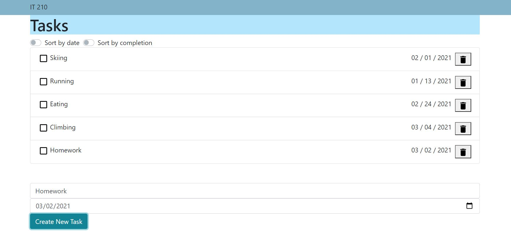
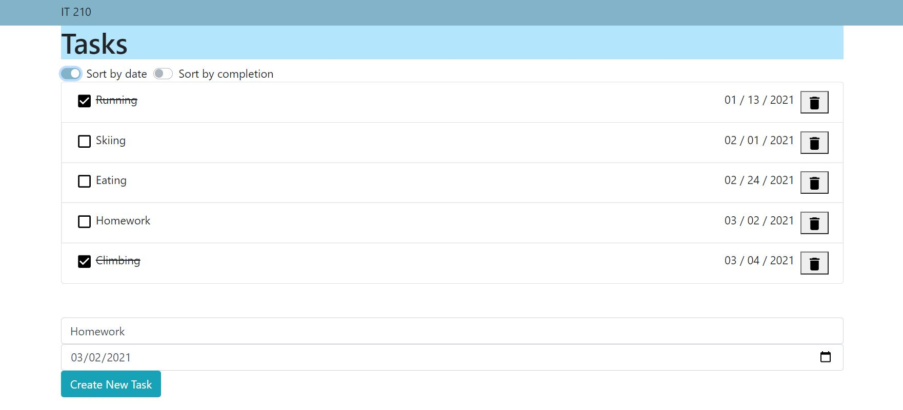
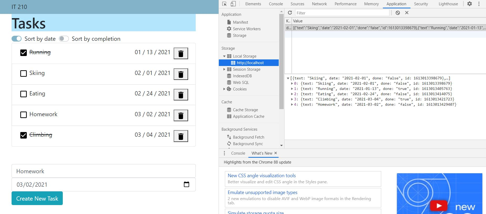
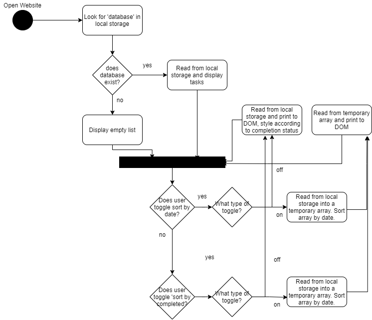
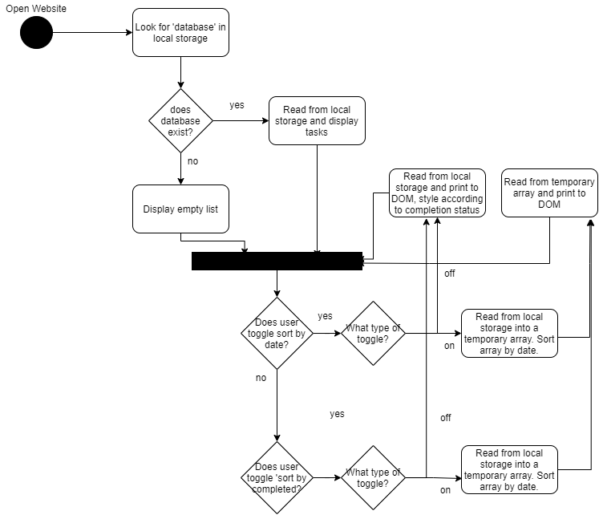

# Colby Lyman
## Summary:
#### A functioning 'task list' made using JavaScript. The user is able to input new tasks and remove tasks. The list is also able to be sorted based on date and hide tasks that are completed. All the data is stored on the user's local storage, making the webpage save between sessions. 
---

## Project Overview

The main webpage

The task list can be sorted by task completion or date

All task list data is stored in local storage

UML Diagram 2a

UMl Diagram 2b
)
